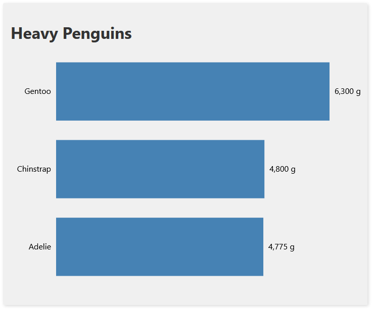

## What is this?
A super simple SVG bar-chart made with Svelte and D3. See the live version here: https://a11y-bar-tabindex.netlify.app.

## Why?
To try to find ways to make these kinds of charts more accessibility-friendly (keyboard-navigation, screen-readers).

## What does the chart currently offer?
- the chart as a whole can be selected via keyboard 
- the screen-reader will announce the chart as follows
  - "Bar-Chart showing the heaviest penguin per species in grams. Group."
- the three bars inside the chart can be selected as well 
- these three bars will be announced as follows
  - "Bar-Chart bars. Selected. Required selection contains 3 items."
- each bar will then be announced as follows
  - "The heaviest penguin of the Adelie species weighed 4,775 grams. 1 of 3."
  - "The heaviest penguin of the Chinstrap species weighed 4,800 grams. 2 of 3."
  - "The heaviest penguin of the Gentoo species weighed 6,300 grams. 3 of 3."
- this offers users the ability to go through the chart step-by-step and go back and forth if desired
## What's the issue?
Currently, this chart uses `tabindex = 0` to make individual bars inside the chart "tab-able". This leads to automatic warnings by Svelte that say

> A11y: noninteractive element cannot have nonnegative tabIndex value 

I'm curious to see if there is a better way to *achieve the same type of enriched keyboard/screen-reader accessibility* while *avoiding the a11y warnings*.